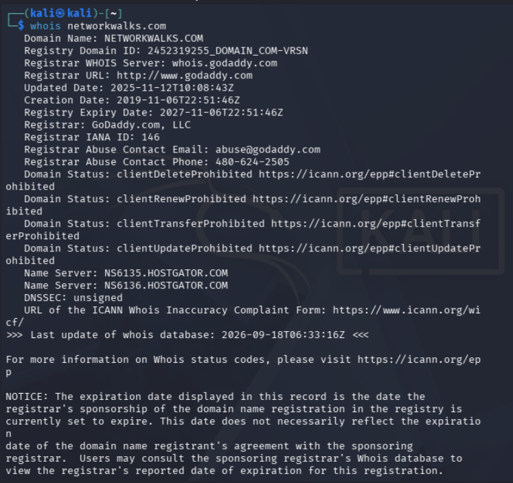
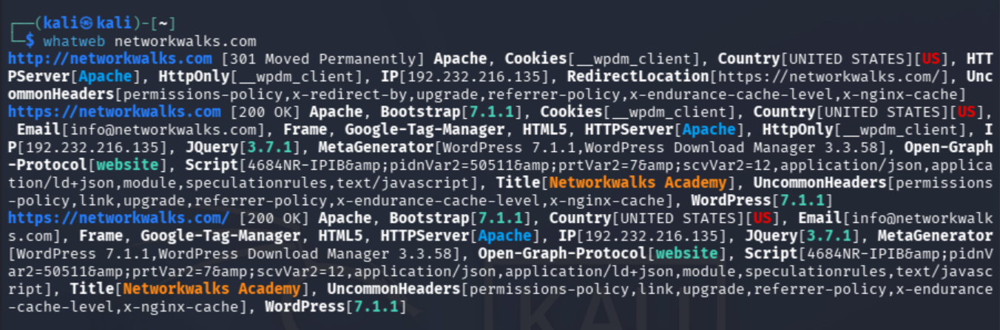
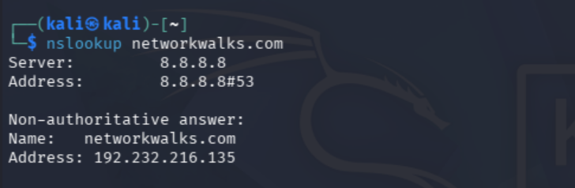
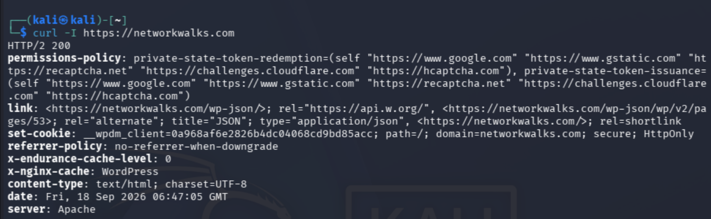
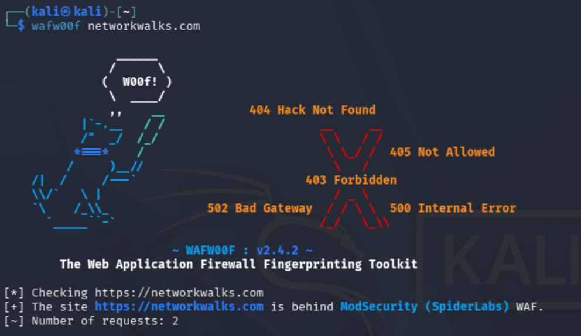
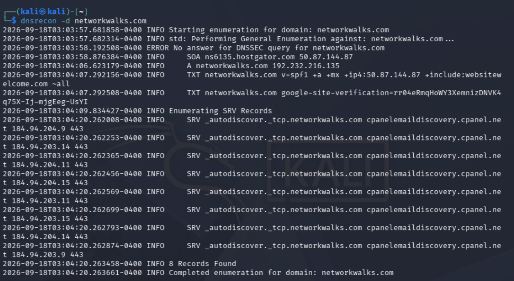
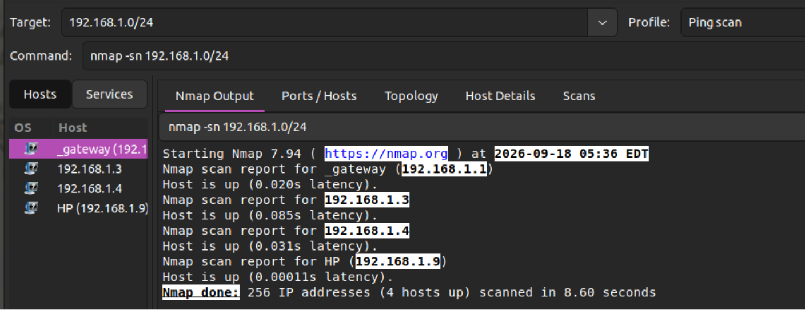
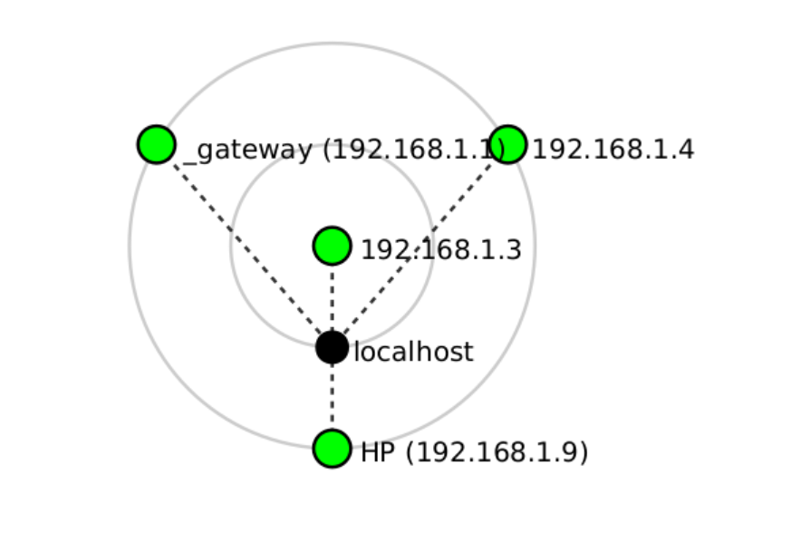

# PENETRATION TESTING
There are 5 phases to each cybersecurity operation/attack: footprinting / reconnaissance, scanning (collecting info about the target), gaining and maintaining access (actual hacking), and clearing logs (non-ethical) or writing reports (ethical).
This report covers only the first two phases: footprinting (using several Kali tools) and scanning (using Zenmap).

## Actions & Tools Used
**alongside evidence collected**
1. Ubuntu & Kali Linux operating systems
2. whois (to find domain registration details like dates and server names) 
3. whatweb (to fingerprint web technologies) 
4. nslookup (resolves a domain name to its IP address) 
5. curl -I (reads HTTP response headers of the website) 
6. wafw00f (detects if a firewall protects the website) 
7. dnsrecon (enumerates DNS records) 
8. zenmap (scans the local subnet to find live hosts)  
9. Linux terminal (to identify IP & MAC addresses)
    using the ip neigh show {ip address} command

## Risk Analysis
The following improvements are highly recommended for better security.
| Risk | Risk Level |
|------|-------------|
| Whatweb identified exposed technologies that attackers might use | Medium |
| Curl returned HTTP response | Low |
| Waf identified ModSecurity which reveals security architecture | Low |
| Multiple live hosts visible on the local network | Medium |

## Recommendations
1. Review exposed technologies
2. Update software regularly
3. Investigate unknown devices

## Disclaimer
All materials and practices in this documentation are for educational purposes only, and all actions were performed after gaining permission.
The risks above are observations, not real vulnerabilities.
